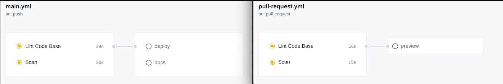

# CI/CD Pipeline

## Status of pipeline and functionalities
- Our pipeline right now focuses on a couple different cases.
  - First, when somebody decides to merge with our main branch, we have a linter that checks the code against style guidelines to make sure that our code looks uniform. This linter will reject mistakes such as character limits and brackets.
  - At the same time, the code is scanned by a static analysis tool to find bugs and enforce code standards. Once these two jobs have passed, a job to deploy to firebase and a job to generate jsdocs and deploy them to github pages run.
  - In the second case of a pull request to main, the linter and scanner run first, then a job to deploy a preview to firebase is run.

- Once the code has passed the style checking and scanning, we plan to add a unit test phase that checks the commit against tests to make sure that the new commit will not damage our updated build. But for now, we have just moved on to the deployment stage, where we generate a jsdoc and deploy to firebase.

