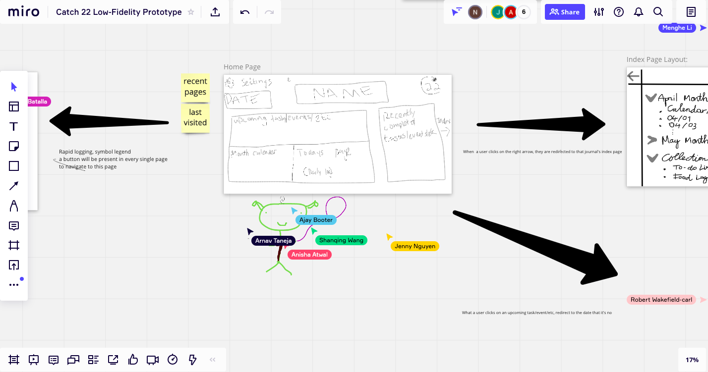

# Brainstorming Session

Date: Thursday, April 22, 2021

Time: 9PM

Team Members: Ajay Booter, Anisha Atwal, Arnav Taneja, Jenny Nguyen, Kyle Batalla, Menghe (Jacky) Li, Nguyen Luong, Robert Wakefield-Carl, Shanqing Wang

## Group discussion
Represent our research about BuJo.

Jenny: likes the signifiers (* and !)

Ajay: looks into pros/cons between paper vs. digital
- Paper: personal, customizable
- Digital: easy to organize & access

Anisha: notices the ability to constantly declutter/get rid off things when using BuJo

Robert: provides lots of features (light/dark, media)

Shanqing: thinks of BuJo as a bird-eye view of tasks. Focus on the 'Migration' function of BuJo

Nguyen: focuses on the daily function of BuJo: reminders

## Miro
Everyone create a Miro board for all the features. Include link to Miro in #links in Stack

## Low-fidelity Mock-up
Similarly, we use Miro to draw up the board for the mock-up
[miro link](https://miro.com/welcomeonboard/kttvzXVvHIK4gYYQyBdX4lim8Z2BpwV5kiIAvQ5UOG2TN4mTxzOn3UhPlyrvcOOR)

(bonding through looking at green alien holding a purple baloon?)

## Link to Features file
[Features.md](../../specs/brainstorm/features.md)

## To-do List
Look into next week tasks and come up with questions for next week meeting w/ Deepak on Monday.

We will have a meeting on weekends to wrap things up.
