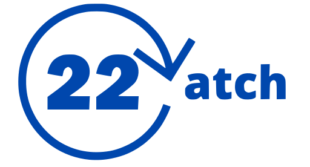

# Catch 22

## Team Members

### Ajay Booter
- Developer
- Computer Engineering - 3rd year
- Union City, CA
- Rock Climbing, Reading, Video Games, Running, Hiking
- Github: https://github.com/AjayBoot

### Anisha Atwal
- Developer
- 2nd year, Computer Science major
- Lake Forest, California
- Hiking, traveling, cooking
- Github: https://github.com/anishatwal

### Arnav Taneja
- Developer
- Statistics and Computer Science - 2nd Year
- Fremont, CA
- Surfing, Golf, Chess, Hiking
- Github: https://github.com/arnavtaneja

### Jacky Li
- Developer
- Senior/CE
- China
- FF VIX, Table Tennis, Movies
- Github: https://github.com/Jacky1278

### Jenny Nguyen
- Project Manager
- 2nd Year Computer Science Major, Business Minor
- Oceanside, CA
- Twitch Streaming/Video Games, spending time with family
- Github: https://github.com/JennyNguyen756

### Kyle Batalla
- Developer
- 2nd Year Transfer CS Major
- Salinas, California
- DJing, Basketball, Video Games
- Github: https://github.com/kylejbatalla

### Nguyen Luong
- Project Management
- 2nd Year Transfer CS Major
- San Jose, CA
- Things I do for fun: cooking, jogging, swimming, skin-care 
- Github: https://github.com/nglu

### Robert Wakefield-Carl
- Developer
- 2nd year Computer Engineering major
- Los Angeles, CA
- Triathlons, orchestra, cybersecurity, reading
- Github: https://github.com/rjwc1

### Shanqing Wang
- Designer
- 3rd year Comp Sci: Bioinformatics
- San Jose, California
- Video Games, Swimming, Music
- Github: https://github.com/shanqingwang

