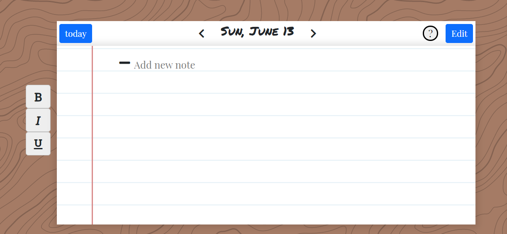
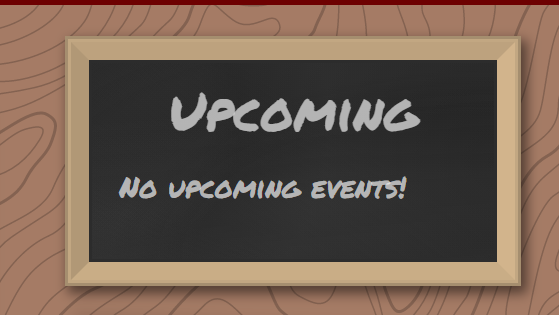

# End User Doc

Date: 06/13/2021

## What is CatchUp?
CatchUp is an online bullet journal that is designed to help students get back on track! Our application focuses on students and mental health which is shown in our features.

## How to use CatchUp?

### How to Start
To use our product, users just need to click on the [link](https://catch-22-e0c66.web.app/) without any installation. However, first time user will need to create a new account to store their data.

### First Time Walkthrough
For first time users, we have created a basic walkthrough to familiarize users with all the available features of our application.

## Features

### Daily Log
This is where users can create tasks or events they want to focus on during the day. Users can travels back to past log and forward to future log to plan ahead. We have provide user with `TODAY` button to help them travel back to current date. The `EDIT` button let users edit already created tasks/events

### Mood Tracker
As we focus on the aspect of mental healh, our mood tracker helps users reflect on their emotion and feeling. We have created a birdeye view of an entire year for our users to see their up and down moment over the year. Users can choose a mood `icon` on the left side of our main page to set it as the mood of the day.

Clicking on `Mood Tracker` on our navigation bar will bring the user to the entire birdeye year view.

### Rose and Thorn
Another feature we have that focuses on our users mental health. In Rose and Thorn, users will write one good thing and one bad thing that
they have experienced during the day as a daily reflection. As we want users to stay focus on one day at the time, all information written in here will be flushed and reseted for the next day. We have provide an `icon` on the top right to better explain this feature to our users.

### Upcoming Board
The Upcoming board provides a quick view of the 3 next upcoming tasks that the users have created in our Calendar page.

### Calendar Tracker
After click on the calendar on the top bar, you will be in the calendar page. In here you can track you assignment and you progress on semester. Click `Start` and `End` to select you date.

Click `+Tracker` to create a new progress bar.

### Setting

Choose you favorite background color and theme and click `Save`. You can log out with you accound by click `LOGOUT`.

## Application on Mobile
Our basic functionality works on mobile devices. However, we are still enhancing our responsiveness in order to provide a better experience for our users.

